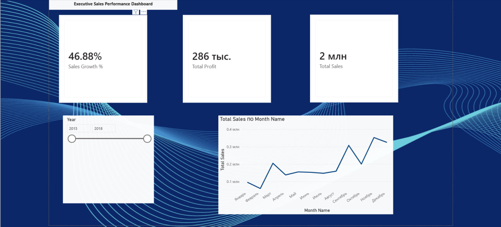

# sales-analytics-sql
End-to-end sales data analysis project using PostgreSQL, Excel, and Power BI.
# SQL Folder

This folder contains all PostgreSQL scripts used in the Sales Analytics project.

## Execution Order

1. **01_database_setup.sql** — Creates the main table.
2. **02_data_profiling.sql** — Performs data quality and profiling checks.
3. **03_data_cleaning.sql** — Cleans and validates the dataset.
4. **04_business_queries.sql** — Answers key business questions.
5. **05_views.sql** — Creates reusable analytical views.
6. **06_indexes.sql** — Creates indexes for query performance optimization.

Database: PostgreSQL
Project: Sales Analytics SQL
## Power BI Dashboard 📊

### 📌 Project Overview
This interactive Power BI dashboard was developed to analyze the company's key performance indicators, including Total Sales, Total Profit, and Year-over-Year growth rates (Sales Growth %). It provides actionable insights for executive decision-making.

### 🛠️ Key Approaches & Technical Implementation:
* **Power Query (Data Cleaning):** Resolved data type mismatches where the `Sales` and `Profit` columns were incorrectly formatted as text. Cleaned and converted them into decimal numbers to enable proper calculations.
* **DAX (Data Analysis Expressions):** Developed an advanced, time-intelligent measure to dynamically calculate the Year-over-Year sales growth percentage:
```dax
Sales Growth % = 
VAR SalesLY = CALCULATE([Total Sales], SAMEPERIODLASTYEAR('Calendar'[Date]))
VAR SalesDifference = [Total Sales] - SalesLY
RETURN
DIVIDE(SalesDifference, SalesLY, 0)
```
* **Data Visualization:** Designed a premium, modern dark blue theme interface featuring rounded corners, subtle shadows, dynamic year slicing, and a chronological monthly sales trend chart.

### 📸 Dashboard Preview

